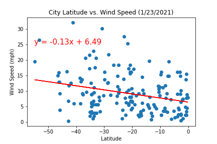

# # University of Denver Data Analytics Boot Camp: API Homework 

## Background
The first portion of this project consisted of making API calls to OpenWeatherMap and importing that data into Python to create plots showing changes in weather parameters vs the distance from the equator. 

## Part I - WeatherPy
The first requirement is to create a series of scatter plots to showcase the following relationships:

* Temperature (F) vs. Latitude

 

* Humidity (%) vs. Latitude

 

* Cloudiness (%) vs. Latitude

 

* Wind Speed (mph) vs. Latitude

 

The second requirement is to run linear regression on each relationship. This time, separate the plots into Northern Hemisphere (greater than or equal to 0 degrees latitude) and Southern Hemisphere (less than 0 degrees latitude):

* Northern Hemisphere - Temperature (F) vs. Latitude

* Southern Hemisphere - Temperature (F) vs. Latitude

* Northern Hemisphere - Humidity (%) vs. Latitude

* Southern Hemisphere - Humidity (%) vs. Latitude

* Northern Hemisphere - Cloudiness (%) vs. Latitude

* Southern Hemisphere - Cloudiness (%) vs. Latitude

* Northern Hemisphere - Wind Speed (mph) vs. Latitude

* Southern Hemisphere - Wind Speed (mph) vs. Latitude!

### Part II - VacationPy

To complete this part of the assignment,you will need to do the following:

* Create a heat map that displays the humidity for every city from Part I.

  

* Narrow down the DataFrame to find your ideal weather condition. 

  * A max temperature lower than 80 degrees but higher than 70.

  * Wind speed less than 10 mph.

  * Zero cloudiness
  
  
  

* Using Google Places API to find the first hotel for each city located within 5000 meters of your coordinates.

* Plot the hotels on top of the humidity heatmap with each pin containing the **Hotel Name**, **City**, and **Country**.

  

